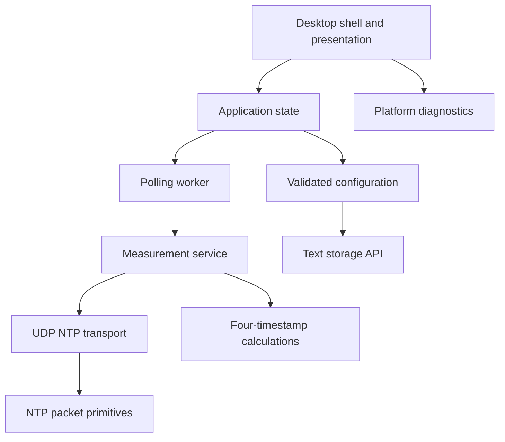

# Component architecture

Master Time is organized as a library of small, UI-independent components plus a thin `eframe` desktop shell. The intended dependency direction is from low-level protocol and measurement code toward application state and presentation; networking does not leak into the calculation layer.

## Layers

### Desktop shell and presentation

`src/main.rs`, `src/app.rs`, and `src/ui.rs` create the native window, render the current snapshot, and translate user controls into start/stop actions. The shell owns the worker handle and receives structured events; it does not perform packet parsing or calculations itself.

### Application state

`src/state.rs` owns the consistent UI-facing snapshot: active configuration, latest successful result, health, connection error, polling state, and bounded offset history. A successful result updates the latest value and history. A failed request records the error while preserving the last successful measurement. Changing the active server clears data associated with the previous server.

### Polling and service

`src/polling.rs` runs a stoppable worker thread. It measures immediately, emits either a success or error event, then waits for the configured interval. `src/service.rs` coordinates one exchange: it captures local send/receive times, validates the server response, and assembles the four timestamps used by the calculation layer.

### Network and protocol

`src/transport.rs` resolves a hostname, binds a local UDP socket, sends a 48-byte NTP client request, waits with a bounded timeout, and validates the response. `src/ntp.rs` contains packet primitives only and has no networking dependency. The standard destination is UDP port `123`; the default receive timeout is five seconds.

### Measurement and health

`src/measurement.rs` computes offset, round-trip delay, and root distance in seconds. `src/health.rs` classifies the result using NTP health inputs. `src/sync_policy.rs` provides correction-policy decisions without changing the system clock.

### Configuration, settings, and storage

`src/config.rs` validates server profiles and polling preferences. `src/settings.rs` provides a draft/apply/cancel model for settings changes. `src/storage.rs` serializes validated application configuration to a small UTF-8 text format and saves it atomically. The desktop shell does not yet connect this storage API to a platform-specific configuration path.

### Platform diagnostics

`src/platform.rs` exposes optional uptime, logical CPU count, and CPU utilization. Unsupported or unavailable values are represented as unavailable rather than fabricated. On Windows, CPU utilization requires two samples.

## Data flow for one poll

1. The UI starts a `PollingWorker` for the validated active server.
2. The worker calls `NtpMeasurementService`.
3. The transport resolves the hostname and exchanges one UDP datagram pair.
4. The service validates server mode and required timestamps.
5. The measurement layer calculates the metrics.
6. The worker evaluates health and emits a structured event.
7. The application state applies the event, and the UI renders the next snapshot.

This separation makes packet, calculation, state, and worker behavior independently testable and keeps a network failure from crashing the presentation layer.
